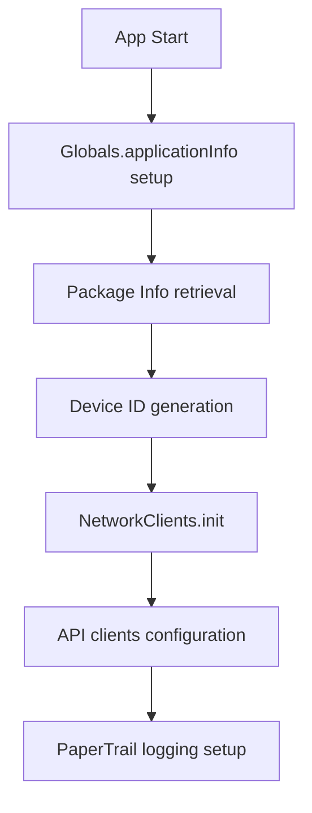
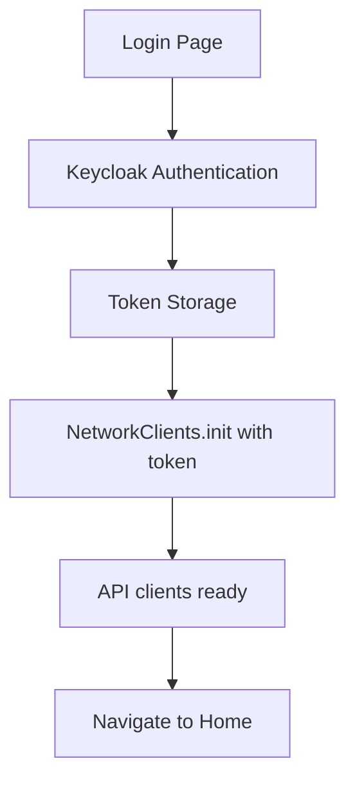
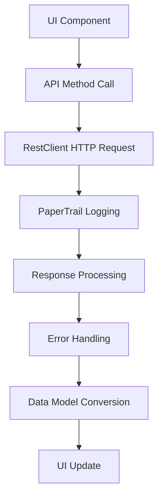

# DartWing Architecture Documentation

## Overview

DartWing is an open-source Flutter framework designed for mobile business application scaffolding. The project consists of two main components:

1. **dartwing_flutter_common** - A shared library containing core functionality, networking, and UI components
2. **dartwing_flutter_frontend** - The main mobile application that implements the DartWing framework

## Project Structure

### High-Level Architecture

```
dartwing/
├── dartwing_flutter_common/     # Shared library/framework
│   ├── core/                    # Core utilities and data models
│   ├── network/                 # Network layer and API clients
│   ├── gui/                     # Shared UI components
│   └── localization/            # i18n support
└── dartwing_flutter_frontend/   # Main mobile application
    ├── lib/
    │   ├── dart_wing/           # Symlinked common library
    │   └── *.dart               # App-specific implementations
    └── pubspec.yaml
```

## Core Architecture Patterns

### 1. **Layered Architecture**

The framework follows a clean layered architecture:

- **Presentation Layer**: Flutter widgets and UI components
- **Business Logic Layer**: Application state management and business rules
- **Network Layer**: API clients and REST communication
- **Data Layer**: Data models and persistent storage

### 2. **Dependency Injection Pattern**

Global state and services are managed through singleton classes:

```dart path=dartwing_flutter_common/core/globals.dart start=7
class Globals {
  static User user = User();
  static ApplicationInfo applicationInfo = ApplicationInfo();
  static bool qaModeEnabled = false;
}
```

### 3. **Repository Pattern**

Network clients are abstracted through API classes that handle business logic:

```dart path=dartwing_flutter_common/network/network_clients.dart start=101
static RestClient dartWingRestClient = RestClient();
static RestClient frappeRestClient = RestClient();

static DartWingApi dartWingApi = DartWingApi(dartWingRestClient, '', '', '');
static HealthcareApi healthcareApi = HealthcareApi(frappeRestClient, '', '', '', '');
```

## Core Components

### 1. **Application Core** (`core/`)

#### Global State Management
- `Globals`: Centralized application state
- `ApplicationInfo`: Application configuration and metadata
- `PersistentStorage`: Local storage wrapper using SharedPreferences

#### Data Models
- JSON serializable models with code generation
- Immutable data structures with factory constructors

### 2. **Network Layer** (`network/`)

#### Architecture Features:
- **Multi-backend Support**: DartWing API and Healthcare (Frappe) API
- **Environment-aware Endpoints**: QA vs Production URL switching
- **Comprehensive Logging**: PaperTrail integration for request/response logging
- **Error Handling**: Structured exception hierarchy
- **Retry Logic**: Built-in retry mechanism with exponential backoff

#### Key Classes:
- `NetworkClients`: Main orchestrator for network initialization
- `BaseNetworkApi`: Abstract base class for API implementations
- `RestClient`: HTTP client wrapper with logging and retry logic

```dart path=dartwing_flutter_common/network/rest_client.dart start=8
static final http.Client _client = RetryClient(http.Client(), retries: 2);
```

### 3. **GUI Framework** (`gui/`)

#### Router System
- **Base Router**: `BaseAppsRouters` provides common navigation patterns
- **App-specific Router**: `DartWingAppsRouters` extends base functionality
- **Dynamic Route Generation**: JSON-based argument passing

#### Reusable Components
- Organization management workflows
- Document repository integration
- Barcode scanning functionality
- OneDrive file explorer

### 4. **Localization** (`localization/`)
- **Multi-language Support**: English and German
- **Easy Localization Integration**: Using `easy_localization` package
- **Fallback Mechanism**: English as default fallback

## Data Flow Architecture

### 1. **Application Initialization**



### 2. **Authentication Flow**



### 3. **API Communication Pattern**



## Key Design Decisions

### 1. **Multi-tenant Architecture**
- Site-based data isolation
- Company/organization scoping
- Dynamic endpoint configuration

### 2. **Security Implementation**
- **Keycloak Integration**: Enterprise-grade authentication
- **Token-based Authorization**: Bearer and API token support
- **Secure Storage**: Device-specific app ID generation

### 3. **Offline-first Approach**
- Local storage for configuration data
- Graceful degradation when network unavailable
- Persistent user preferences

### 4. **Development Experience**
- **Code Generation**: JSON serialization via `build_runner`
- **Type Safety**: Comprehensive Dart type system usage
- **Environment Configuration**: QA/Production mode switching

## Scalability Patterns

### 1. **Modular Design**
- Shared library approach enables multiple apps
- Plugin-based feature architecture
- Loosely coupled components

### 2. **API Abstraction**
- Multiple backend support (DartWing + Frappe)
- Consistent interface across different data sources
- Environment-specific configuration

### 3. **State Management**
- Global state for cross-cutting concerns
- Local state for component-specific data
- Persistent storage for user preferences

## Technology Stack

### Frontend
- **Framework**: Flutter 3.9.0+
- **Language**: Dart
- **State Management**: Stateful widgets with global singletons
- **Navigation**: Flutter Navigator with custom routing
- **UI Components**: Material Design 3

### Backend Integration
- **Authentication**: Keycloak
- **Primary API**: DartWing .NET Gatekeeper
- **Secondary API**: Frappe (Healthcare)
- **Logging**: PaperTrail

### Storage & Data
- **Local Storage**: SharedPreferences
- **Network**: HTTP with retry logic
- **Serialization**: JSON with code generation

### Development Tools
- **Code Generation**: `build_runner`, `json_serializable`
- **Linting**: `flutter_lints`
- **Localization**: `easy_localization`

## Extensions and Customization

### Adding New APIs
1. Extend `BaseNetworkApi`
2. Add to `NetworkClients` initialization
3. Implement specific endpoints

### Custom UI Components
1. Add to `gui/widgets/` in common library
2. Follow Material Design patterns
3. Support internationalization

### New Business Modules
1. Create module-specific routing
2. Implement data models with JSON serialization
3. Add to main router configuration

## Performance Considerations

### Network Optimization
- HTTP client connection pooling
- Request/response compression
- Retry logic with exponential backoff

### Memory Management
- Singleton pattern for heavy objects
- Lazy initialization where appropriate
- Proper disposal of resources

### User Experience
- Loading states and progress indicators
- Offline capability messaging
- Error recovery mechanisms

## Deployment Architecture

### Multi-environment Support
- **QA Environment**: `https://*-qa.tech-corps.com`
- **Production Environment**: `https://*.opensoft.one`
- **Debug Mode**: Automatic QA mode detection

### Configuration Management
- Environment-specific URLs
- Feature flags through build configuration
- Site and company-specific settings

This architecture provides a solid foundation for building enterprise-grade mobile business applications with Flutter, emphasizing maintainability, scalability, and developer experience.