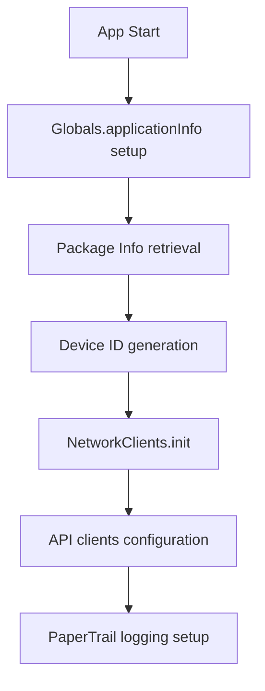
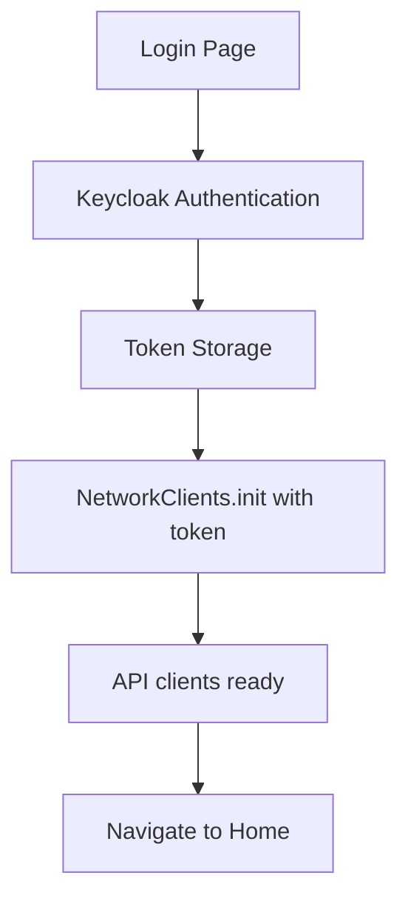
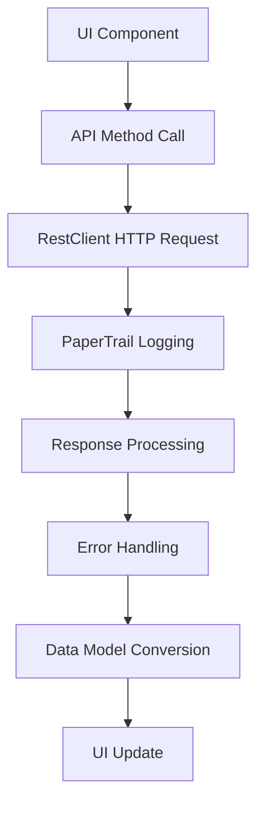

# Dartwing Project Architecture

## Project Overview

This is the **Dartwing Project Orchestrator** repository - it serves as the main setup and coordination point for the complete Dartwing project ecosystem.

DartWing is an enterprise-grade Flutter framework designed for mobile business application scaffolding. The project consists of four separate repositories that are cloned and managed by this orchestrator:

1. **Flutter App** (`app/`) - The primary Flutter mobile application (cloned from GitHub)
2. **Gatekeeper Service** (`gateway/`) - The .NET backend API service (cloned from GitHub)
3. **Flutter Library** (`lib/`) - Shared Flutter components and utilities (cloned from GitHub)
4. **Frappe Integration** (`frappe/`) - Frappe ERP integration module (cloned from GitHub)

## Orchestrator Repository Structure

### Repository Contents
This orchestrator repository contains:
- `setup-dartwing-project.sh` - Main setup script that clones all components
- `scripts/test-devcontainers.sh` - Devcontainer validation script
- `README.md` - Quick start and project overview
- `docs/arch.md` - This architecture documentation
- `.gitignore` - Excludes cloned components (they have their own git history)

### High-Level Architecture

```
dartwing/ (orchestrator)
├── setup.sh                       # Wrapper script
├── README.md                      # Project overview
├── docs/arch.md                   # Architecture documentation
├── .gitignore                     # Excludes cloned components
│
├── app/                           # Flutter mobile app (cloned)
│   ├── .git/                      # App's own git repo
│   ├── lib/
│   │   ├── main.dart              # Entry point
│   │   └── *.dart                 # App-specific code
│   ├── pubspec.yaml               # Flutter dependencies
│   └── .devcontainer/             # Development environment
│
├── gateway/                        # .NET backend service (cloned)
│   ├── .git/                      # Gateway's own git repo
│   ├── Controllers/               # API controllers
│   ├── Services/                  # Business logic
│   ├── Models/                    # Data models
│   └── Program.cs                 # Service entry point
│
├── lib/                           # Shared Flutter library (cloned)
│   ├── .git/                      # Lib's own git repo
│   ├── core/                      # Core utilities
│   │   ├── data/                  # Data models with JSON serialization
│   │   ├── globals.dart           # Global state management
│   │   └── persistent_storage.dart
│   ├── network/                   # API clients
│   │   ├── dart_wing/            # DartWing API
│   │   ├── healthcare/           # Healthcare API (Frappe support)
│   │   └── base_api.dart         # Base API class
│   ├── gui/                       # Reusable UI components
│   │   ├── widgets/
│   │   ├── organization/
│   │   └── scanner_page.dart
│   └── localization/              # i18n resources
│
└── frappe/                        # Frappe ERP integration (cloned)
    ├── .git/                      # Frappe's own git repo
    ├── integration/               # Integration modules
    └── api/                       # Frappe API clients
```

## Setup and Development

### Initial Setup

1. **Clone this orchestrator repository**:
   ```bash
   git clone https://github.com/opensoft/Dartwing.git dartwing
   cd dartwing
   ```

2. **Run the setup script**:
   ```bash
   ./setup.sh
   ```
   This will:
   - Clone the app, gateway, lib, and frappe repositories
   - Run the update-project script to configure the development environment
   - Set up devcontainer configurations

### Setup Script Options

```bash
# Clone/update specific branch (default: devcontainer)
./setup.sh --branch feature/my-branch

# Skip running the update-project configuration script
./setup.sh --skip-update-project

# Test that each subproject devcontainer builds successfully
./setup.sh --test-devcontainers

# Show help
./setup.sh --help
```

### Flutter App Development

After setup, all Flutter commands should be run from the app directory:

```bash
# Navigate to Flutter app
cd app

# Install dependencies
flutter pub get

# Analyze code
flutter analyze

# Run tests
flutter test

# Generate JSON serialization code
flutter pub run build_runner build --delete-conflicting-outputs

# Run the app
flutter run

# Build for release
flutter build apk  # Android
flutter build ios  # iOS
```

### Backend (Gatekeeper) Development

For .NET backend service development:

```bash
# Navigate to gatekeeper service
cd gateway

# Restore dependencies
dotnet restore

# Build the project
dotnet build

# Run the service
dotnet run
```

### Git Workflow

#### Orchestrator Repository
- This repository manages project setup and configuration
- Contains documentation and setup scripts
- Does not contain actual source code (that's in component repos)

#### Component Repositories
- **app/**: Flutter mobile application repository
- **gateway/**: .NET backend service repository
- **lib/**: Shared Flutter library repository
- **frappe/**: Frappe ERP integration repository
- Each has its own git workflow: `develop` → `main`
- Commit format: `#TICKET_NUMBER Description`

#### Making Changes
1. Work in the appropriate component directory (`app/`, `gateway/`, `lib/`, or `frappe/`)
2. Commit changes in the component's git repository
3. Push changes to the component's remote repository

#### JSON Code Generation (Flutter)
When modifying `@JsonSerializable` models:
1. Edit the model in `lib/` directory
2. Run from `app/` directory:
   ```bash
   flutter pub run build_runner build --delete-conflicting-outputs
   ```
3. Commit both `.dart` and `.g.dart` files in respective repositories

#### Updating Project
To get latest changes from all component repositories:
```bash
./setup.sh
```

## Key Technologies

### Flutter App & Shared Library
- **Flutter SDK**: ^3.6.1
- **State Management**: Global state via Globals class
- **Authentication**: Keycloak integration
- **JSON Serialization**: json_annotation + build_runner
- **Localization**: easy_localization (en, de)
- **Key Dependencies**: mobile_scanner, keycloak_wrapper, upgrader

### Backend Service
- **Framework**: .NET
- **Architecture**: RESTful API service
- **Purpose**: Primary backend API (Gatekeeper)

### Frappe Integration
- **Healthcare Module**: Healthcare API support
- **ERP Integration**: Frappe-based business functionality

## Framework Architecture

The following sections detail the internal architecture of the DartWing framework, which is used across the shared library (`lib/`) and Flutter app (`app/`).

## Core Architecture Patterns

### 1. **Layered Architecture**

The framework follows a clean layered architecture:

- **Presentation Layer**: Flutter widgets and UI components
- **Business Logic Layer**: Application state management and business rules
- **Network Layer**: API clients and REST communication
- **Data Layer**: Data models and persistent storage

### 2. **Dependency Injection Pattern**

Global state and services are managed through singleton classes:

```dart path=dartwing_flutter_common/core/globals.dart start=7
class Globals {
  static User user = User();
  static ApplicationInfo applicationInfo = ApplicationInfo();
  static bool qaModeEnabled = false;
}
```

### 3. **Repository Pattern**

Network clients are abstracted through API classes that handle business logic:

```dart path=dartwing_flutter_common/network/network_clients.dart start=101
static RestClient dartWingRestClient = RestClient();
static RestClient frappeRestClient = RestClient();

static DartWingApi dartWingApi = DartWingApi(dartWingRestClient, '', '', '');
static HealthcareApi healthcareApi = HealthcareApi(frappeRestClient, '', '', '', '');
```

## Core Components

### 1. **Application Core** (`core/`)

#### Global State Management
- `Globals`: Centralized application state
- `ApplicationInfo`: Application configuration and metadata
- `PersistentStorage`: Local storage wrapper using SharedPreferences

#### Data Models
- JSON serializable models with code generation
- Immutable data structures with factory constructors

### 2. **Network Layer** (`network/`)

#### Architecture Features:
- **Multi-backend Support**: DartWing API and Healthcare (Frappe) API
- **Environment-aware Endpoints**: QA vs Production URL switching
- **Comprehensive Logging**: PaperTrail integration for request/response logging
- **Error Handling**: Structured exception hierarchy
- **Retry Logic**: Built-in retry mechanism with exponential backoff

#### Key Classes:
- `NetworkClients`: Main orchestrator for network initialization
- `BaseNetworkApi`: Abstract base class for API implementations
- `RestClient`: HTTP client wrapper with logging and retry logic

```dart path=dartwing_flutter_common/network/rest_client.dart start=8
static final http.Client _client = RetryClient(http.Client(), retries: 2);
```

### 3. **GUI Framework** (`gui/`)

#### Router System
- **Base Router**: `BaseAppsRouters` provides common navigation patterns
- **App-specific Router**: `DartWingAppsRouters` extends base functionality
- **Dynamic Route Generation**: JSON-based argument passing

#### Reusable Components
- Organization management workflows
- Document repository integration
- Barcode scanning functionality
- OneDrive file explorer

### 4. **Localization** (`localization/`)
- **Multi-language Support**: English and German
- **Easy Localization Integration**: Using `easy_localization` package
- **Fallback Mechanism**: English as default fallback

## Data Flow Architecture

### 1. **Application Initialization**



### 2. **Authentication Flow**



### 3. **API Communication Pattern**



## Key Design Decisions

### 1. **Multi-tenant Architecture**
- Site-based data isolation
- Company/organization scoping
- Dynamic endpoint configuration

### 2. **Security Implementation**
- **Keycloak Integration**: Enterprise-grade authentication
- **Token-based Authorization**: Bearer and API token support
- **Secure Storage**: Device-specific app ID generation

### 3. **Offline-first Approach**
- Local storage for configuration data
- Graceful degradation when network unavailable
- Persistent user preferences

### 4. **Development Experience**
- **Code Generation**: JSON serialization via `build_runner`
- **Type Safety**: Comprehensive Dart type system usage
- **Environment Configuration**: QA/Production mode switching

## Scalability Patterns

### 1. **Modular Design**
- Shared library approach enables multiple apps
- Plugin-based feature architecture
- Loosely coupled components

### 2. **API Abstraction**
- Multiple backend support (DartWing + Frappe)
- Consistent interface across different data sources
- Environment-specific configuration

### 3. **State Management**
- Global state for cross-cutting concerns
- Local state for component-specific data
- Persistent storage for user preferences

## Technology Stack

### Frontend
- **Framework**: Flutter 3.9.0+
- **Language**: Dart
- **State Management**: Stateful widgets with global singletons
- **Navigation**: Flutter Navigator with custom routing
- **UI Components**: Material Design 3

### Backend Integration
- **Authentication**: Keycloak
- **Primary API**: DartWing .NET Gatekeeper
- **Secondary API**: Frappe (Healthcare)
- **Logging**: PaperTrail

### Storage & Data
- **Local Storage**: SharedPreferences
- **Network**: HTTP with retry logic
- **Serialization**: JSON with code generation

### Development Tools
- **Code Generation**: `build_runner`, `json_serializable`
- **Linting**: `flutter_lints`
- **Localization**: `easy_localization`

## Extensions and Customization

### Adding New APIs
1. Extend `BaseNetworkApi`
2. Add to `NetworkClients` initialization
3. Implement specific endpoints

### Custom UI Components
1. Add to `gui/widgets/` in common library
2. Follow Material Design patterns
3. Support internationalization

### New Business Modules
1. Create module-specific routing
2. Implement data models with JSON serialization
3. Add to main router configuration

## Performance Considerations

### Network Optimization
- HTTP client connection pooling
- Request/response compression
- Retry logic with exponential backoff

### Memory Management
- Singleton pattern for heavy objects
- Lazy initialization where appropriate
- Proper disposal of resources

### User Experience
- Loading states and progress indicators
- Offline capability messaging
- Error recovery mechanisms

## Deployment Architecture

### Multi-environment Support
- **QA Environment**: `https://*-qa.tech-corps.com`
- **Production Environment**: `https://*.opensoft.one`
- **Debug Mode**: Automatic QA mode detection

### Configuration Management
- Environment-specific URLs
- Feature flags through build configuration
- Site and company-specific settings

This architecture provides a solid foundation for building enterprise-grade mobile business applications with Flutter, emphasizing maintainability, scalability, and developer experience.